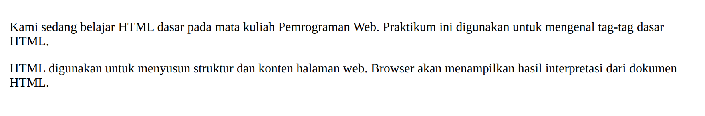
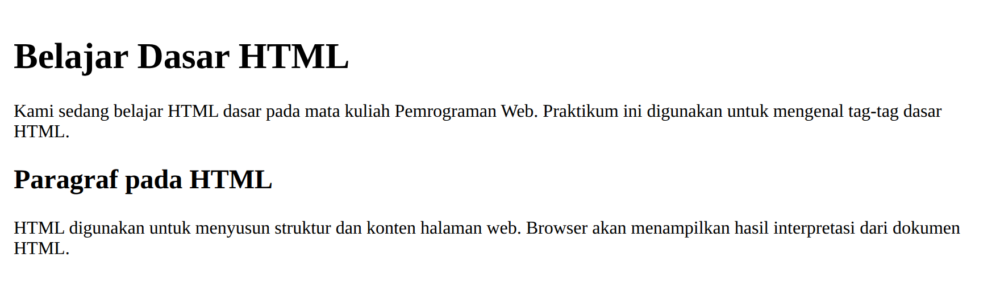
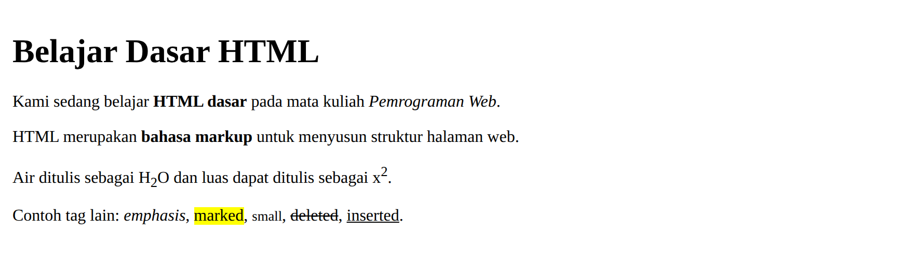
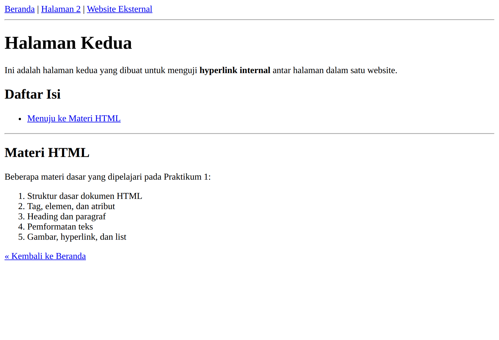
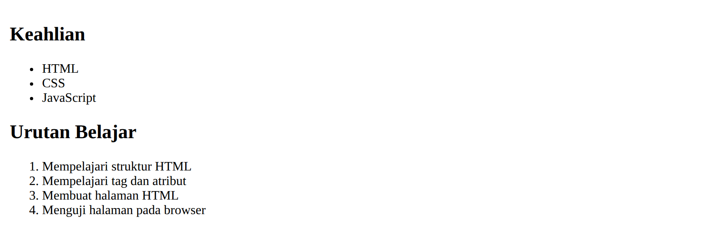
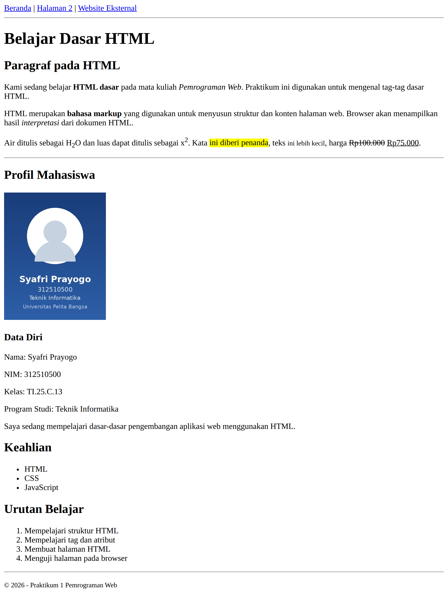

# Laporan Praktikum 1 — HTML Dasar

**Mata Kuliah:** Pemrograman Web <br>
**Dosen Pengampu:** Agung Nugroho <br>
**Universitas Pelita Bangsa** — Fakultas Teknik — Teknik Informatika

| Keterangan | Isi |
|---|---|
| Nama | Syafri Prayogo |
| NIM | 312510500 |
| Kelas | TI.25.C.3 |
| Program Studi | Teknik Informatika |

---

## 1. Tujuan Praktikum

1. Mahasiswa mampu memahami struktur dasar HTML.
2. Mahasiswa mampu memahami tag-tag dasar HTML.
3. Mahasiswa mampu membuat dokumen HTML.

## 2. Dasar Teori

HTML (HyperText Markup Language) adalah bahasa markup untuk membuat halaman web dan menampilkan informasi di browser. HTML berupa kode tag yang menginstruksikan browser menghasilkan tampilan sesuai keinginan.

Dokumen HTML tersusun dari tiga bagian utama: deklarasi tipe dokumen (`<!DOCTYPE html>`), bagian `<head>` yang berisi informasi halaman seperti `<title>`, dan bagian `<body>` yang berisi konten yang ditampilkan. **Elemen** adalah kombinasi tag pembuka, isi, dan tag penutup, dan dapat memiliki **atribut** untuk memberi informasi tambahan.

## 3. Alat dan Bahan

| Alat / Bahan | Keterangan |
|---|---|
| Text Editor | Visual Studio Code |
| Web Browser | Google Chrome / Mozilla Firefox |
| Version Control | Git dan GitHub (repository `Lab1Web`) |

---

## 4. Langkah-langkah Praktikum

Setiap tahap disertai kode yang ditulis pada `index.html` dan screenshot hasil tampilannya pada browser.

### 4.1 Membuat Struktur Dasar Dokumen

Buat folder kerja `praktikum-1-html-dasar`, lalu buat file `index.html` berisi kerangka dasar HTML5.

```html
<!DOCTYPE html>
<html>
<head>
    <title>Praktikum HTML Dasar</title>
</head>
<body>

</body>
</html>
```


> *Gambar 4.1 — Halaman masih kosong; hanya judul tab yang berubah menjadi "Praktikum HTML Dasar".*

### 4.2 Membuat Paragraf

Tambahkan dua paragraf menggunakan tag `<p>` di dalam `<body>`.

```html
<!-- Ini adalah paragraf pertama -->
<p>
Kami sedang belajar HTML dasar pada mata kuliah Pemrograman Web.
Praktikum ini digunakan untuk mengenal tag-tag dasar HTML.
</p>

<!-- Ini adalah paragraf kedua -->
<p>
HTML digunakan untuk menyusun struktur dan konten halaman web.
Browser akan menampilkan hasil interpretasi dari dokumen HTML.
</p>
```



> *Gambar 4.2 — Dua paragraf tampil dengan jarak antar paragraf otomatis dari browser.*

### 4.3 Menambahkan Judul (Heading)

Tambahkan `<h1>` sebelum paragraf pertama dan `<h2>` sebelum paragraf kedua.

```html
<!-- judul utama -->
<h1>Belajar Dasar HTML</h1>

<!-- subjudul -->
<h2>Paragraf pada HTML</h2>
```



> *Gambar 4.3 — Heading h1 tampil paling besar/tebal, h2 lebih kecil sebagai subjudul.*

### 4.4 Memformat Teks

Terapkan tag pemformatan: tebal, miring, penting, penekanan, subscript, superscript, penanda, teks kecil, hapus, dan sisip.

```html
<p>Kami sedang belajar <b>HTML dasar</b> pada mata kuliah <i>Pemrograman Web</i>.</p>
<p>HTML merupakan <strong>bahasa markup</strong> untuk menyusun struktur.</p>
<p>Air ditulis H<sub>2</sub>O dan luas x<sup>2</sup>.</p>
<p><em>emphasis</em>, <mark>marked</mark>, <small>small</small>, <del>deleted</del>, <ins>inserted</ins></p>
```



> *Gambar 4.4 — Efek tiap tag: bold, italic, subscript/superscript, highlight, coret, dan garis bawah.*

### 4.5 Menyisipkan Gambar

Simpan gambar di folder `images/`, lalu tampilkan dengan tag `` beserta atribut `src`, `width`, `alt`, dan `title`.

```html
<h3>Menambahkan Gambar</h3>

```


> *Gambar 4.5 — Gambar tampil dengan lebar 200px sesuai atribut width.*

### 4.6 Mengatur Ukuran Gambar

Ukuran gambar diatur lewat atribut `width` / `height`. Berikut perbandingan tiga lebar berbeda (120px, 180px, 240px).

```html


```


> *Gambar 4.6 — Perbandingan gambar sama dengan lebar berbeda; tinggi menyesuaikan proporsional.*

### 4.7 Menambahkan Hyperlink dan Navigasi

Buat `<nav>` berisi link internal (`index.html`, `halaman2.html`) dan link eksternal (Google) memakai tag `<a>` dengan atribut `href`.

```html
<!-- navigasi halaman -->
<nav>
    <a href="index.html">Beranda</a>
    <a href="halaman2.html">Halaman 2</a>
    <a href="https://www.google.com">Website Eksternal</a>
</nav>
<hr>
```



> *Gambar 4.7 — Halaman 2 yang dituju link internal, lengkap dengan anchor "Menuju ke Materi HTML".*

### 4.8 Menambahkan List

Buat daftar tak berurutan (`<ul>`) untuk keahlian dan daftar berurutan (`<ol>`) untuk urutan belajar.

```html
<h2>Keahlian</h2>
<ul>
    <li>HTML</li>
    <li>CSS</li>
    <li>JavaScript</li>
</ul>

<h2>Urutan Belajar</h2>
<ol>
    <li>Mempelajari struktur HTML</li>
    <li>Mempelajari tag dan atribut</li>
    <li>Membuat halaman HTML</li>
    <li>Menguji halaman pada browser</li>
</ol>
```



> *Gambar 4.8 — `ul` memakai bullet, `ol` memakai nomor urut otomatis.*

### 4.9 Menggabungkan Semua Elemen (Halaman Profil Mahasiswa)

Semua elemen digabung menjadi satu halaman `index.html`: navigasi, heading, paragraf berformat, gambar, list, dan komentar.



> *Gambar 4.9 — Tampilan akhir `index.html` yang menggabungkan seluruh elemen praktikum.*

---

## 5. Jawaban Pertanyaan

**1. Apa fungsi deklarasi `<!DOCTYPE html>`?**
Memberi tahu browser bahwa dokumen memakai standar HTML5, sehingga browser merender halaman dengan mode standar (bukan quirks mode). Ditulis paling awal dokumen.

**2. Apa perbedaan tag, elemen, dan atribut?**
Tag adalah penanda berbentuk `<...>` (misalnya `<p>`). Elemen adalah kesatuan tag pembuka, isi, dan tag penutup (misalnya `<p>isi</p>`). Atribut adalah informasi tambahan pada tag pembuka (misalnya `href`, `src`, `alt`).

**3. Apa perbedaan `<p>` dan `<br>`?**
`<p>` membuat paragraf (blok teks dengan jarak atas-bawah, memiliki tag penutup), sedangkan `<br>` hanya memindah baris di dalam teks (tanpa jarak, tanpa tag penutup). `<p>` dipakai untuk memisah paragraf, `<br>` untuk ganti baris seperti pada alamat atau puisi.

**4. Apa fungsi atribut `href` pada `<a>`?**
Menentukan alamat tujuan (URL, path, atau anchor) saat link diklik — bisa halaman internal, website eksternal, atau bagian tertentu dalam halaman yang sama (`#id`).

**5. Apa perbedaan hyperlink internal dengan eksternal?**
Hyperlink internal menuju halaman dalam website yang sama dan memakai path relatif (`href="halaman2.html"`). Hyperlink eksternal menuju website lain dan memakai URL lengkap dengan protokol (`href="https://www.google.com"`).

**6. Apa fungsi atribut `src` dan `alt` pada ``?**
`src` menentukan lokasi atau path file gambar yang ditampilkan. `alt` adalah teks alternatif yang muncul bila gambar gagal dimuat, sekaligus membantu aksesibilitas (screen reader) dan SEO.

**7. Apa perbedaan `<ul>` dan `<ol>`?**
`<ul>` (unordered list) adalah daftar dengan bullet, dipakai bila urutan tidak penting. `<ol>` (ordered list) adalah daftar dengan nomor, dipakai bila urutan penting. Keduanya berisi item `<li>`.

**8. Apa yang terjadi jika path `src` gambar salah?**
Gambar tidak tampil (muncul ikon gambar rusak), dan browser menampilkan teks pada atribut `alt` sebagai gantinya.

**9. Mengapa struktur heading h1–h6 perlu digunakan secara terstruktur?**
Agar hierarki konten jelas dan logis (h1 sebagai judul utama, lalu turun ke subjudul). Hal ini penting untuk keterbacaan, aksesibilitas (navigasi screen reader), dan SEO. Heading sebaiknya tidak melompati level (jangan h1 langsung ke h4).

**10. Apa fungsi komentar `<!-- ... -->`?**
Memberi catatan pada kode yang diabaikan browser (tidak tampil di halaman). Berguna untuk menandai bagian kode atau menonaktifkan kode sementara.

---

## 6. Struktur Output Repository

```
Lab1Web/
├── index.html        # halaman utama (gabungan semua elemen)
├── halaman2.html     # halaman kedua (uji link internal + anchor)
├── images/
│   └── profil.jpg    # gambar profil
├── screenshots/      # hasil screenshot tiap tahap
└── README.md         # laporan / dokumentasi praktikum
```

## 7. Checklist Penyelesaian

- [x] Struktur HTML sudah lengkap.
- [x] Heading dan paragraf sudah digunakan.
- [x] Pemformatan teks sudah dicoba.
- [x] Gambar tampil dengan benar.
- [x] Hyperlink internal dan eksternal dapat digunakan.
- [x] Unordered list dan ordered list sudah dibuat.
- [x] Komentar HTML sudah dicoba.
- [x] Screenshot setiap tahap sudah tersedia.
- [x] README.md sudah menjelaskan proses praktikum.
- [x] Repository siap di-commit dan URL siap dikirim.

## 8. Kesimpulan

Melalui Praktikum 1 ini telah dipahami struktur dasar dokumen HTML5 yang terdiri dari `<!DOCTYPE>`, `<head>`, dan `<body>`, serta konsep tag, elemen, dan atribut. Berbagai tag dasar berhasil diterapkan — heading, paragraf, pemformatan teks, gambar, hyperlink, dan list — hingga digabung menjadi satu halaman Profil Mahasiswa yang utuh.

Hasil setiap tahap sesuai harapan saat diuji pada browser, dan struktur HTML sudah valid (tag pembuka dan penutup seimbang). Praktikum berikutnya akan melanjutkan ke CSS dan JavaScript sesuai RPS.
